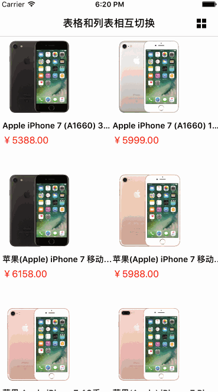

# 列表和网格视图的相互切换
## 前言
在很多电商 app 中，都有列表视图和网格视图的相互切换。例如京东和淘宝。
先来看下效果图，下图为京东商城的截图。


很多人看到这个，第一眼想到的是用``` TableView ```和``` CollectionView ```来做切换，笔者刚开始也是认为这么做，后来发现还有一个非常的简单方法，就可以实现这个功能。
## 正文

* 首先创建一个``` CollectionView ```。

```objc
- (UICollectionView *)collectionView
{
    if (!_collectionView)
    {
        UICollectionViewFlowLayout *flowlayout = [[UICollectionViewFlowLayout alloc] init];
        //设置滚动方向
        [flowlayout setScrollDirection:UICollectionViewScrollDirectionVertical];
        //左右间距
        flowlayout.minimumInteritemSpacing = 2;
        //上下间距
        flowlayout.minimumLineSpacing = 2;
        _collectionView = [[UICollectionView alloc] initWithFrame:CGRectMake(2 , 2 , self.view.bounds.size.width - 4, self.view.bounds.size.height - 4) collectionViewLayout:flowlayout];
        _collectionView.delegate = self;
        _collectionView.dataSource = self;
        _collectionView.showsVerticalScrollIndicator = NO;
        _collectionView.showsHorizontalScrollIndicator = NO;
        [_collectionView setBackgroundColor:[UIColor clearColor]];
        //注册cell
        [_collectionView registerClass:[GridListCollectionViewCell class] forCellWithReuseIdentifier:kCellIdentifier_CollectionViewCell];
    }
    return _collectionView;
}
```
* 然后去京东商城抓取``` json ```数据，再去解析数据装入模型，```objectWithDictionary:```是将字典转化为模型，这个工具是我用* Runtime *写的，一行代码解析数据，具体使用方法可以参考我简书上另一篇文章[【Objective-C中的Runtime】](http://www.jianshu.com/p/3e050ec3b759)。

```objc
[self.view addSubview:self.collectionView];

NSString *path = [[NSBundle mainBundle] pathForResource:@"product" ofType:@"json"];
NSData *data = [NSData dataWithContentsOfFile:path];
NSDictionary *dict = [NSJSONSerialization JSONObjectWithData:data options:NSJSONReadingAllowFragments error:nil];

NSArray *products = dict[@"wareInfo"];
for (id obj in products) {
    [self.dataSource addObject:[GridListModel objectWithDictionary:obj]];
}
```
*  再去自定义``` CollectionViewCell ```，给``` cell ```添加一个属性``` isGrid ```，用来判断是列表还是格子视图。
.h文件：

```
#import <UIKit/UIKit.h>

#define kCellIdentifier_CollectionViewCell @"GridListCollectionViewCell"

@class GridListModel;

@interface GridListCollectionViewCell : UICollectionViewCell

/**
0：列表视图，1：格子视图
*/
@property (nonatomic, assign) BOOL isGrid;

@property (nonatomic, strong) GridListModel *model;

@end
```
.m文件

```objc
#import "GridListCollectionViewCell.h"
#import "GridListModel.h"
#import "UIImageView+WebCache.h"

#define ScreenWidth ([UIScreen mainScreen].bounds.size.width)

@interface GridListCollectionViewCell ()

@property (nonatomic, strong) UIImageView *imageV;
@property (nonatomic, strong) UILabel *titleLabel;
@property (nonatomic, strong) UILabel *priceLabel;

@end

@implementation GridListCollectionViewCell

- (instancetype)initWithFrame:(CGRect)frame
{
    self = [super initWithFrame:frame];
    if (self) {
        [self configureUI];
    }
    return self;
}

- (void)configureUI
{
    _imageV = [[UIImageView alloc] initWithFrame:CGRectZero];
    [self.contentView addSubview:_imageV];

    _titleLabel = [[UILabel alloc] initWithFrame:CGRectZero];
    _titleLabel.numberOfLines = 0;
    _titleLabel.font = [UIFont boldSystemFontOfSize:14];
    [self.contentView addSubview:_titleLabel];

    _priceLabel = [[UILabel alloc] initWithFrame:CGRectZero];
    _priceLabel.textColor = [UIColor redColor];
    _priceLabel.font = [UIFont systemFontOfSize:16];
    [self.contentView addSubview:_priceLabel];
}

- (void)setIsGrid:(BOOL)isGrid
{
    _isGrid = isGrid;

    if (isGrid) {
        _imageV.frame = CGRectMake(5, 5, self.bounds.size.width - 60, self.bounds.size.width - 60);
        _titleLabel.frame = CGRectMake(5, self.bounds.size.width - 45, ScreenWidth/2, 20);
        _priceLabel.frame = CGRectMake(5, self.bounds.size.width - 20, ScreenWidth/2, 20);
        } else {
        _imageV.frame = CGRectMake(5, 5, self.bounds.size.height - 10, self.bounds.size.height - 10);
        _titleLabel.frame = CGRectMake(self.bounds.size.height + 10, 0, ScreenWidth/2, self.bounds.size.height - 20);;
        _priceLabel.frame = CGRectMake(self.bounds.size.height + 10, self.bounds.size.height - 30, ScreenWidth/2, 20);;
    }
}

- (void)setModel:(GridListModel *)model
{
    _model = model;

    [_imageV sd_setImageWithURL:[NSURL URLWithString:model.imageurl]];
    _titleLabel.text = model.wname;
    _priceLabel.text = [NSString stringWithFormat:@"￥%.2f",model.jdPrice];
}

@end

```

* 再添加一个切换视图的按钮，按钮的点击事件如下：

```objc
#pragma mark - Action

- (IBAction)onBtnClick:(id)sender
{
    _isGrid = !_isGrid;
    [self.collectionView reloadData];

    if (_isGrid) {
        [self.swithBtn setImage:[UIImage imageNamed:@"product_list_grid_btn"] forState:0];
    } else {
        [self.swithBtn setImage:[UIImage imageNamed:@"product_list_list_btn"] forState:0];
    }
}
```
这样子就大体实现了列表视图和网格视图的相互切换，是不是炒鸡简单。

Demo 运行效果的Gif


## 最后
由于笔者水平有限，文中如果有错误的地方，还望大神指出。或者有更好的方法和建议，我们可以一起交流。
附上本文的 demo 下载链接，[【GitHub】](https://github.com/leejayID/List2Grid)，配合demo一起看文章，效果会更佳。
如果你看完后觉得对你有所帮助，还望在GitHub上点个star。赠人玫瑰，手有余香。
